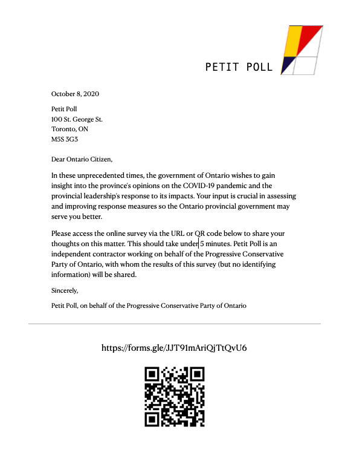
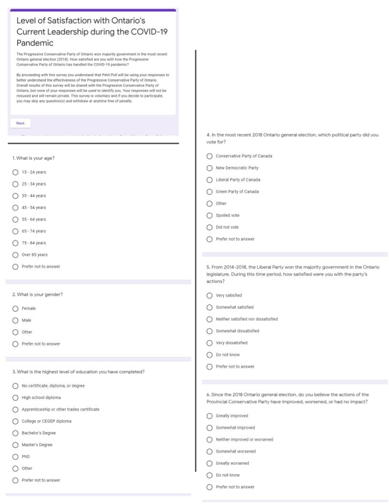
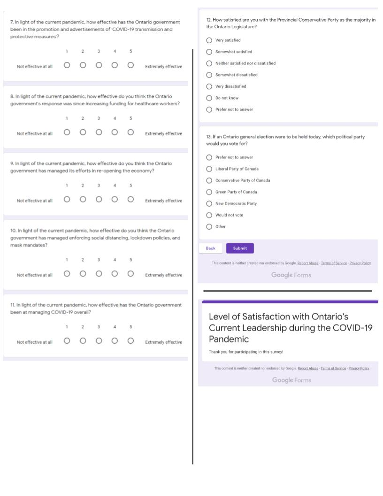

```{r setup, include=FALSE}
#install.packages("knitr")
library(knitr)
knitr::opts_chunk$set(echo = TRUE)

```


```{r, echo=FALSE, warning=FALSE, message=FALSE}
# Un-comment to install packages if needed.

#install.packages("tidyverse")
library(tidyverse)
#install.packages("ggthemes")
library(ggthemes)
#install.packages("knitr")
library(knitr)
#install.packages("ggplot2")
library(ggplot2)

```


# Executive summary

In the midst of the COVID-19 pandemic, Doug Ford, the leader of the Progressive Conservative Party of Ontario, has pledged he is “for the people'' by focusing on the wellbeing of Ontarians and keeping money in the economy (Ontario PC Party).  We at Petit Poll have partnered with the Progressive Conservative Party of Ontario to find out whether the average Ontarian feels the party has lived up to their promise. Historically, Ontario has had volatile shifts in government power, and with the pandemic becoming highly politicized, we wanted to see if the government’s management of COVID-19 is a major deciding factor for voters.

To find this imperative information from all over the province, we have stratified the population of Ontario. Petit Poll has chosen to survey voters based on the riding they reside in, and in doing so, have mailed out a one-time survey to 1 in every 5500 of residents per riding. This is our chosen methodology because we wanted to sample a strong geographic distribution of potential voters to better gauge their political views. In this report, Petit Poll can confidently announce we have delivered a quick and engaging survey to Ontarians in addition to delivering thought-provoking results and analysis to the Progressive Conservative Party of Ontario.

After curating the responses, we can report two major yet ironic findings: Ontarians generally view the provincial government's response to COVID-19 as effective, and yet, if the Ontario general election were to occur today, the Progressive Conservative Party of Ontario would lose marginally to the Liberals. Our findings come from several COVID-19 questions that touched on healthcare, economy, and policy which all came back in favour of Conservative management. However, our final question on asking ‘who would vote for today?’ resulted in a Conservative loss. 

Though unexpected, Petit Poll has analyzed this outcome which holds significant connotations to the Progressive Conservative Party of Ontario. On the positive, we know that most voters think the current government has handled the pandemic well. The flip side to this is that in the eyes of voters, COVID-19 management is not enough to keep the Progressive Conservative Party of Ontario in power today. Petit Polls hypothesize that this may be due to other trending topics the party has responded to. This includes the increased funding of police during the Black Lives Matter protests, decreased funding to educational programs like OSAP, and increased class sizes to name a few.

This hypothesis illustrates a weakness in our survey- we have no answers to why voters voted a certain way or how the party can improve. "Why did voters originally vote Conservative?", "Why do voters prefer the Liberal Party?", "What do voters like and dislike about the Conservatives?", "How can they do better?" are questions we cannot answer at this stage but would require further testing. Other areas of weakness include not capturing all the residents in a household, missed opportunity to discuss the pandemic more thoroughly, how to combat non-response, and too simplistic of a survey. If the Progressive Conservative Party of Ontario sees fit, we’d like to explore the how’s and why’s, track trends in specific ridings, and potentially create a logical survey that conveys a different series of questions based on whether the respondents would vote Conservative or non-Conservative. Overall, we believe the set of questions asked in our survey was a good starting point to grasp voters' current political viewpoint and subsequent monthly surveys are encouraged to learn more.

This report is hosted on https://github.com/wijdantariq/STA304-PS2 

# Introduction

In the 2018 Ontario General Election, the Progressive Conservative Party of Ontario won the majority government in legislature. As junior statisticians at Petit Poll, we partnered with the Progressive Conservative Party of Ontario to provide them with monthly polling updates. Based on current events relating to the COVID-19, we wanted to gauge Ontarians’ satisfaction levels with how the party has responded to the pandemic. As Ontarians have been impacted by COVID-19 due to policy mandation, we believe that based on the policy regulation, this may impact voters’ opinions towards the provincial government. Our aim is to help the Conservative Party further understand if current policies align with the public’s values and for potential adjustment of policies for the future. 

A short survey was created and conducted to assess Ontarians’ opinions which included sampling via stratified random sampling (without replacement) from residential mailing addresses within the 124 provincial electoral ridings. Although the survey is conducted online, it is important that our sample population be reached via mail to ensure proper stratification and geographic distribution. The mailing letter included the purpose, URL and corresponding QR code to allow individuals to access the survey. To help reduce response bias from those with strong political views or those affected by the pandemic, we aimed to introduce the survey to appeal to all individuals, highlighting the significance of individual input in public health and economic responses. From the responses, our survey reveals an overall positive attitude towards the Provincial Conservative government’s COVID-19 response, with high proportions rated “extremely effective”. However, when polled pertaining to the context of voter choice in a hypothetical election, the largest number of “votes” were designated to the Liberal Party, despite a previously negative view of the prior Liberal government. This suggests that though the COVID-19 response may play a large role in the public perception of the Conservative Party’s leadership and effectiveness, various industries and sectors of the government must be further analyzed for a further holistic view.

From our survey questions pertaining to electoral voting patterns, it was observed that responses pertaining to the current provincial government’s pandemic response may include response bias. Limitations to our methodology included simplified analyses based on multiple choices or ranking of questions. For future consideration, open-ended questions may be added as an option to incorporate further in-depth analysis of respondents’ opinions. As well, our survey approach captures responses from only one member from each sampled household, to ensure sample size accuracy and avoidance of duplicate responses. However, this may not be entirely representative of the opinions within a household. Future surveys may include collection of information based on post stratification of riding and postal code to observe geographic differences based on region. The survey also did not account for testing of further questions such as why voters voted in a particular manner, and did not directly address future improvements the Conservative Party can make. To determine Ontarians’ overall satisfaction with the Provincial Conservative Party, a further in depth holistic survey must be accounted for.

```{r, echo=FALSE, warning=FALSE, message=FALSE}
# We use set.seed() so that the results are reproducible. Sample size is 2000.
sample_size<-2000

# This following codes create simulations of responses to each of our survey items.
# To make the code more readable, each survey item is mentioned before each variable.

# For Q1 to Q3, we use the latest census data for Ontario to assign probabilities to each response.

# Q1: "How old are you? If you prefer not to answer, please respond with an age of 0 (zero)."
set.seed(2020)
q1 = sample(x=c(1:9), size = sample_size, replace = TRUE, 
             prob=c(0.15,0.15,0.15,0.18,0.16,0.11,0.06,0.03,0.01))

# Q2: "What is your gender?"
set.seed(2021)
q2 = sample(x=c(1:4), size = sample_size, replace = TRUE, 
                prob=c(0.51,0.48,0.005,0.005))

# Q3: "What is the highest level of education you have completed?"
set.seed(2022)
q3 = sample(x=c(1:9), size = sample_size, replace = TRUE,
                   prob=c(0.18, 0.28, 0.06, 0.20, 0.18, 0.05, 0.02, 0.02, 0.01))

# For Q4, we used the popular vote results for the 2018 provincial elections.
# Q4: "In the most recent 2018 Ontario general election, which political party did you vote for?"
set.seed(2023)
q4 = sample(x=c(1:8), size = sample_size, replace = TRUE, 
                   prob=c(0.4, 0.33, 0.19, 0.04, 0.01, 0.01, 0.01, 0.01))

# For Q5, we use the probabilities from Q4 to guide the probabilities here.
# Q5: "From 2014-2018, the Liberal Party won the majority government in the Ontario legislature. During this time period, how satisfied were you with the party’s actions?"
set.seed(2024)
q5 = sample(x=c(1:7), size = sample_size, replace = TRUE,
                         prob=c(0.1, 0.07, 0.02, 0.30, 0.40, 0.1, 0.01))

# For Q6, we use, as a guide, the latest poll data from https://newsinteractives.cbc.ca/onvotes/poll-tracker/
# Q6: "Since the 2018 Ontario general election, do you believe the actions of the Provincial Conservative Party have improved, worsened, or had no impact?"
set.seed(2025)
q6 = sample(x=c(1:7), size = sample_size, replace = TRUE,
                         prob=c(0.25, 0.15, 0.20, 0.15, 0.20, 0.04, 0.01))

# For Q7, we use latest poll data from Abacus about COVID related to 'communicating with people' available at https://abacusdata.ca/ontario-political-update-doug-ford-image-may2020/
# Q7: "In light of the current pandemic, how effective has Ontario been in the promotion and advertisements of  'COVID-19 transmission and protective measures'?"
set.seed(2026)
q7 = sample(x=c(1:5), size = sample_size, replace = TRUE,
            prob=c(0.10, 0.05, 0.23, 0.19, 0.43))

# For Q8, we use latest poll data from Abacus about COVID related to 'managing the healthcare system' available at https://abacusdata.ca/ontario-political-update-doug-ford-image-may2020/
# Q8: "In light of the current pandemic, how effective do you think Ontario's response was since increasing funding for healthcare workers?"
set.seed(2027)
q8 = sample(x=c(1:5), size = sample_size, replace = TRUE,
            prob=c(0.18, 0.09, 0.28, 0.13, 0.32))

# For Q9, we use latest poll data from Abacus about COVID related to 'handling the economy' available at https://abacusdata.ca/ontario-political-update-doug-ford-image-may2020/
# Q9: "In light of the current pandemic, how effective do you think Ontario has managed its efforts in re-opening the economy?"
set.seed(2028)
q9 = sample(x=c(1:5), size = sample_size, replace = TRUE,
            prob=c(0.12, 0.05, 0.32, 0.16, 0.35))

# For Q10, we use latest poll data from Abacus about COVID related to 'responding to the COVID pandemic' available at https://abacusdata.ca/ontario-political-update-doug-ford-image-may2020/
# Q10: "In light of the current pandemic, how effective do you think Ontario has managed enforcing social distancing, lockdown policies, and mask mandates?"
set.seed(2029)
q10 = sample(x=c(1:5), size = sample_size, replace = TRUE,
            prob=c(0.06, 0.02, 0.17, 0.22, 0.53))

# For Q11, we use latest poll data from Abacus about COVID related to 'responding to the COVID pandemic' available at https://abacusdata.ca/ontario-political-update-doug-ford-image-may2020/
# Q11: "In light of the current pandemic, how effective has Ontario been at managing COVID-19 overall?"
set.seed(2030)
q11 = sample(x=c(1:5), size = sample_size, replace = TRUE,
            prob=c(0.06, 0.02, 0.17, 0.22, 0.53))

# For Q12, we use Ontario government approval poll data from https://abacusdata.ca/ontario-political-update-doug-ford-image-may2020/
# Q12: How satisfied are you with the Provincial Conservative Party as the majority in the Ontario Legislature?"
set.seed(2031)
q12 = sample(x=c(1:7), size = sample_size, replace = TRUE,
                         prob=c(0.20, 0.40, 0.24, 0.1, 0.05, 0.005, 0.005))


# For Q13, we use latest poll data from Abacus on "provincial vote intention" available at https://abacusdata.ca/ontario-political-update-doug-ford-image-may2020/
# Q13: "If an Ontario general election were to be held today, which political party would you vote for?"
set.seed(2032)
q13 = sample(x=c(1:7), size = sample_size, replace = TRUE,
                         prob=c(0.36, 0.19, 0.38, 0.05, 0.01, 0.005, 0.005))

```


```{r, echo=FALSE, warning=FALSE, message=FALSE}
# Create a tibble of our simulated data.

our_data <- tibble(q1, q2, q3, q4, q5, q6, q7, q8, q9, q10, q11, q12, q13)

```


```{r, echo=FALSE, warning=FALSE, message=FALSE}
# Create factor labels for our variables.

our_data$q1 = factor(our_data$q1, 
   levels = c(1, 2, 3, 4, 5, 6, 7, 8, 9), 
   labels = c("15-24 years", "25-34 years", "35-44 years", "45-54 years", 
              "55-64 years", "65-74 years", "75-84 years", "Over 85 years", 
              "Prefer not to answer")
   )

our_data$q2 = factor(our_data$q2, 
   levels = c(1, 2, 3, 4), 
   labels = c("Female", "Male", "Other", "Prefer not to answer")
   )

our_data$q3 = factor(our_data$q3, 
   levels = c(1, 2, 3, 4, 5, 6, 7, 8, 9), 
   labels = c("No certificate, diploma, or degree", 
              "High school diploma", "Apprenticeship or other trades certificate",
              "College or CEGEP diploma", "Bachelor's Degree", "Master's Degree",
              "PhD", "Other", "Prefer not to answer")
   )

our_data$q4 = factor(our_data$q4, 
   levels = c(1, 2, 3, 4, 5, 6, 7, 8), 
   labels = c("Conservative Party of Canada", 
              "New Democratic Party", "Liberal Party of Canada",
              "Green Party of Canada", "Other", "Spoiled vote",
              "Did not vote", "Prefer not to answer")
   )

our_data$q5 = factor(our_data$q5, 
   levels = c(1, 2, 3, 4, 5, 6, 7), 
   labels = c("Very satisfied", "Somewhat satisfied",
              "Neither satisfied nor dissatisfied", "Somewhat dissatisfied",
              "Very dissatisfied", "Do not know", "Prefer not to answer")
   )

our_data$q6 = factor(our_data$q6, 
   levels = c(1, 2, 3, 4, 5, 6, 7), 
   labels = c("Very satisfied", "Somewhat satisfied",
              "Neither satisfied nor dissatisfied", "Somewhat dissatisfied",
              "Very dissatisfied", "Do not know", "Prefer not to answer")
   )

our_data$q7 = factor(our_data$q7, 
   levels = c(1, 2, 3, 4, 5), 
   labels = c("Not effective at all", "Slightly effective", "Somewhat effective",
              "Very Effective", "Extremely effective")
   )

our_data$q8 = factor(our_data$q8, 
   levels = c(1, 2, 3, 4, 5), 
   labels = c("Not effective at all", "Slightly effective", "Somewhat effective",
              "Very Effective", "Extremely effective")
   )

our_data$q9 = factor(our_data$q9, 
   levels = c(1, 2, 3, 4, 5), 
   labels = c("Not effective at all", "Slightly effective", "Somewhat effective",
              "Very Effective", "Extremely effective")
   )

our_data$q10 = factor(our_data$q10, 
   levels = c(1, 2, 3, 4, 5), 
   labels = c("Not effective at all", "Slightly effective", "Somewhat effective",
              "Very Effective", "Extremely effective")
   )

our_data$q11 = factor(our_data$q11, 
  levels = c(1, 2, 3, 4, 5), 
   labels = c("Not effective at all", "Slightly effective", "Somewhat effective",
              "Very Effective", "Extremely effective")
   )

our_data$q12 = factor(our_data$q12, 
   levels = c(1, 2, 3, 4, 5, 6, 7), 
   labels = c("Very satisfied", "Somewhat satisfied",
              "Neither satisfied nor dissatisfied", "Somewhat dissatisfied",
              "Very dissatisfied", "Do not know", "Prefer not to answer")
   )

our_data$q13 = factor(our_data$q13, 
   levels = c(1, 2, 3, 4, 5, 6, 7), 
   labels = c("Conservative Party of Canada", 
              "New Democratic Party", "Liberal Party of Canada",
              "Green Party of Canada", "Other", "Would not vote", 
              "Prefer not to answer")
   )

```

# Survey methodology 

We aimed to assess the opinions of the population of Ontario by sampling from residential mailing addresses in the province. Within this frame we stratified by the 124 provincial electoral ridings based on affiliated postal codes, and randomly sample within each strata (without replacement) selecting a number of addresses proportionate to the overall population of that riding for a sample size of 2000 households (approximately one household per 5500 riding residents).

Electoral ridings are a pre-existing segmentation of the population which require no additional data collection prior to sampling and contain comparable populations between strata (relative to other potential geographic strata such as municipal boundaries). Variations in population between ridings can be accounted for by sampling in proportion to riding population and by weighting results in the event of disproportionate response numbers (Wu & Thompson, 2020). By stratifying our frame based on electoral riding, we aimed to combat over representation from more populated areas, more politically engaged or polarized ridings, or regions impacted particularly heavily or lightly by the COVID-19 pandemic.

Although the survey itself was conducted online, it was important that our sample population be reached via mail due to the nature of our stratification and sampling frame, and to ensure a proper geographic distribution. Potential respondents were mailed an invitation including a brief introduction to the survey, its affiliations (the Ontario provincial government, particularly the Progressive Conservative Party), and its purpose, and a simple URL and corresponding QR code allowing individuals to complete the survey online. The Conservative Party of Ontario will be expensed for the printing and postage of survey materials (approximately $2,000.00 in postage and $1,000.00 in printing and paper costs) while Petit Poll will absorb the cost of survey construction, data analysis, and all digital products as a marketing expense throughout the duration of the contract.

Response and non-response bias could cause particular issues within our sample, with potential for the survey to only attract responses from those with strong opinions on the provincial Conservative Party or on the current events (namely the COVID-19 pandemic) in question. To combat this factor, we attempt to appeal to the universal nature of the pandemic in the introduction to the survey and highlight the significance of individual input in the province's ongoing public health and economic response. This is also a reason we chose to mail the survey directly to potential respondents instead of allowing the general public to respond, as targeting individuals directly may help increase response rate from those less opinionated on the subject matter.

In efforts to protect respondent privacy, the same URL was distributed to all respondents but restricted to one submission per user/household. The survey submissions will not be connected to individual addresses, and the only demographic questions asked pertain to age, gender, and education in order to limit the amount of personal information disclosed.

\newpage

# Discussion and Results 

## Survey

A survey was created to determine Ontarians’ satisfaction towards the Progressive Conservative Party of Ontario based on their responses to the COVID-19 pandemic. The short survey consists of 13 questions which focus on categories relating to demographic, opinions on past political parties, opinions on the current Conservative party and its handling of the COVID-19 pandemic. The aims of the report are based on past, present, and potential future opinions from Ontarians towards the Conservative Party. Our survey questions reflect this flow based on order of question as it transitions from topics of past opinions, to current events, to present-day choices.The question’s potential answers were presented on a multiple choice basis for categorical options, and a ranked linear scale for questions regarding COVID-19 opinions (questions 7-11). A ranking scale from 1-5 (1 being not effective, and 5 being most effective) was chosen to convey potential answers rather than categorical options, such as seen in Questions 5, 6 and 12. We did this on the belief that all Ontarians have been impacted by COVID-19 and will likely have an opinion, whereas not all Ontarians may have interest, knowledge, or opinions in politics. For our final question, the order of political parties listed as options may have influenced the respondent’s choice on who to vote for rather than personal opinion. Hence,  we chose to shuffle the options for responses to avoid response bias from our respondents. The survey is also aimed for respondents to answer in under 5 minutes to deter from survey fatigue. Altogether, the survey aimed to predict Ontarians’ future voting choices based on the current COVID-19 pandemic and deliver straightforward results to the Conservative Party of Ontario. 

## Results

From the questions pertaining to the provincial government's response to COVID-19 (Figures 9 to 13), we see that Ontarians generally view the government's response favourably. The majority of responses in Figures 9 through 13 fell between somewhat to extremely effective, with "Extremely effective" as the most popular response in each of the five questions. The results displayed in Figure 10 (pertaining to funding for healthcare workers) show a noticeably less skewed distribution compared to the other related questions, with high proportions of respondents stating the government's response was "Not effective at all" or "Somewhat effective". While this may be indicative of a negative opinion towards the government's response in this sector, it may also be due to the more direct impact of this type of funding on a certain subset of the population (i.e. healthcare workers), which could lead the general public to feel less confident in assessing its overall effectiveness. The high proportion of “Extremely effective” responses across the COVID-19-related questions may also indicate a response bias towards those who feel strongly positively about the provincial government’s pandemic recovery measures.

In terms of previous voting habits, the survey's results are unsurprising given the results of the 2018 election: our results in Figure 4 followed the distribution of votes in the 2018 provincial election closely, and a large proportion of respondents were dissatisfied with the previous Liberal government (Figure 5). While the largest number of respondents stated they are "Very satisfied" with the current Conservative government, responses to this question were relatively evenly distributed across levels of satisfaction (Figure 6). In contrast, when asked the same question without the context of the Liberal Party and after the questions pertaining to COVID-19, respondents reported satisfaction much more frequently and with a much more skewed distribution (Figure 14). This is again contrasted when assessing voter choice in a hypothetical election (Figure 15), wherein the largest number of "votes" were allocated to the Liberal Party (with the incumbent Conservative Party in second place) despite an overall negative view of the previous Liberal government and overall positive view of the current Conservative government in light of their COVID-19 response. The comparable amount of responses indicating a desire to vote either Liberal or Conservative may show that those who felt strongly for or against the Conservative Party were more likely to respond to the survey which would constitute a bias in our data.

This is an indication that COVID-19 response may factor greatly into public opinion of the Conservative Party's leadership and its effectiveness. Ontarians appear to be generally satisfied with the current provincial government in light of the COVID-19 pandemic, but may not be satisfied with the Conservative Party in its leadership role overall. It is also clear that the province's current state of satisfaction may not be enough to sway public opinion in the context of an election. Although COVID-19 response is a significant topic of interest today, there are likely other decisions or policies from earlier in the Conservative administration that have had a more significant long-term negative impact on their favorability as a party. Public opinion on COVID-19 response is a useful metric for current satisfaction and is important to track as the province continues to face the pandemic, but in judging overall satisfaction with the provincial Conservative Party, a more holistic survey will be necessary.


```{r, echo=FALSE, warning=FALSE, message=FALSE}
# The next blocks of code create our figures.
```

```{r, echo=FALSE, fig.cap="Distribution of the survey respondent's age (in years).", out.width = '100%', fig.align="center"}
# Figure for Q1.
ggplot(our_data,aes(x=q1, fill=q1)) + geom_bar() + scale_color_fivethirtyeight() + theme_fivethirtyeight() + labs(title="Survey respondents's age") + theme(legend.title = element_blank()) + theme(axis.text.x = element_text(angle = 45, vjust = 1, hjust=1)) + theme(legend.position = "none") + theme(plot.title=element_text(hjust = 0.5, size = 14))
```

```{r, echo=FALSE, fig.cap="Distribution of the survey respondent's gender.", out.width = '100%', fig.align="center"}
# Figure for Q2.
ggplot(our_data,aes(x=q2, fill=q2)) + geom_bar() + scale_color_fivethirtyeight() + theme_fivethirtyeight() + labs(title="Survey respondents's gender") + theme(legend.title = element_blank()) + theme(axis.text.x = element_text(angle = 45, vjust = 1, hjust=1)) + theme(legend.position = "none") + theme(plot.title=element_text(hjust = 0.5, size = 14))
```

```{r, echo=FALSE, fig.cap="Distribution of the survey respondent's highest level of education.", out.width = '100%', fig.align="center"}
# Figure for Q3.
ggplot(our_data,aes(x=q3, fill=q3)) + geom_bar() + scale_color_fivethirtyeight() + theme_fivethirtyeight() + labs(title="Survey respondents's highest level of education") + theme(legend.title = element_blank()) + coord_flip() + theme(legend.position = "none") + theme(plot.title=element_text(hjust = 1, size = 14))
```

```{r, echo=FALSE, fig.cap="Survey respondents's vote in last Ontario elections.", out.width = '100%',fig.align="center"}
# Figure for Q4.
ggplot(our_data,aes(x=q4, fill=q4)) + geom_bar() + scale_color_fivethirtyeight() + theme_fivethirtyeight() + labs(title="Survey respondents's vote in last Ontario elections") + theme(legend.title = element_blank()) + coord_flip() + theme(legend.position = "none") + theme(plot.title=element_text(hjust = 1, size = 14))
```

```{r, echo=FALSE, fig.cap="Satisfaction with previous Liberal government in Ontario.", out.width = '100%', fig.align="center"}
# Figure for Q5.
ggplot(our_data,aes(x=q5, fill=q5)) + geom_bar() + scale_color_fivethirtyeight() + theme_fivethirtyeight() + labs(title="Satisfaction with previous Liberal government in Ontario") + theme(legend.position = "none")  + coord_flip()+ theme(plot.title=element_text(hjust = 1, size = 14))
```

```{r, echo=FALSE, fig.cap="Perceptions of current Conservative provincial government's actions compared to past Liberal provincial government.", out.width = '100%', fig.align="center"}
# Figure for Q6.
ggplot(our_data,aes(x=q6, fill=q6)) + geom_bar() + scale_color_fivethirtyeight() + theme_fivethirtyeight() + labs(title="Perception of current Conservative government actions...", subtitle = "...compared to past Liberal government") + theme(legend.position = "none") + coord_flip()+ theme(plot.title=element_text(hjust = 1, size = 14))
```

```{r, echo=FALSE, fig.cap="Provincial vote choice by age group.", out.width = '100%', fig.align="center"}
# Figure to show relationship between responses to Q1 and Q13.
ggplot(our_data,aes(x=q1, fill=q13)) + geom_bar() + scale_color_fivethirtyeight() + theme_fivethirtyeight() + labs(title="Provincial vote choice by age group...", subtitle = "...if elections were held today") + coord_flip() + theme(plot.title=element_text(hjust = 0, size = 14))+ theme(legend.title = element_blank())+theme(legend.text = element_text(size = 6)) 
```

```{r, echo=FALSE, fig.cap="Provincial vote choice by gender.", out.width = '100%', fig.align="center"}
# Figure to show relationship between responses to Q13 and Q2.
ggplot(our_data,aes(x=q13, fill=q2)) + geom_bar() + scale_color_fivethirtyeight() + theme_fivethirtyeight() + labs(title="Provincial vote choice by gender...", subtitle = "...if provincial elections were held today") + coord_flip()+ theme(plot.title=element_text(hjust = 0, size = 14))+ theme(legend.title = element_blank())+theme(legend.text = element_text(size = 8)) 
```

```{r, echo=FALSE, fig.cap="Perception of provincial government's effectiveness in COVID-19 messaging.", out.width = '100%', fig.align="center"}
# Figure for Q7.
ggplot(our_data,aes(x=q7, fill=q7)) + geom_bar() + scale_color_fivethirtyeight() + theme_fivethirtyeight() + labs(title="Perception of Ontario's effectiveness in...", subtitle = "...communication on COVID-19 transmission") + theme(legend.position = "none") + coord_flip()+ theme(plot.title=element_text(hjust = 0, size = 14))
```

```{r, echo=FALSE, fig.cap="Perception of provincial government's effectiveness in increasing funding for healthcare workers.", out.width = '100%', fig.align="center"}
# Figure for Q8.
ggplot(our_data,aes(x=q8, fill=q8)) + geom_bar() + scale_color_fivethirtyeight() + theme_fivethirtyeight() + labs(title="Perception of Ontario's effectiveness in...", subtitle = "...increasing funding for healthcare workers") + theme(legend.position = "none") + coord_flip()+ theme(plot.title=element_text(hjust = 0, size = 14))
```

```{r, echo=FALSE, fig.cap="Perception of provincial government's effectiveness in reopening the economy.", out.width = '100%', fig.align="center"}
# Figure for Q9.
ggplot(our_data,aes(x=q9, fill=q9)) + geom_bar() + scale_color_fivethirtyeight() + theme_fivethirtyeight() + labs(title="Perception of Ontario's effectiveness in...", subtitle = "...re-opening the economy") + theme(legend.title = element_blank())  + coord_flip() + theme(legend.position = "none") + theme(plot.title=element_text(hjust = 0, size = 14))
```   

```{r, echo=FALSE, fig.cap="Perception of provincial government's effectiveness in enforcing lockdown mesaures.", out.width = '100%', fig.align="center"}
# Figure for Q10.
ggplot(our_data,aes(x=q10, fill=q10)) + geom_bar() + scale_color_fivethirtyeight() + theme_fivethirtyeight() + labs(title="Perception of Ontario's effectiveness in...", subtitle = "...enforcing social distancing, lockdowns, and mask mandates") + theme(legend.title = element_blank()) + coord_flip() + theme(legend.position = "none") + theme(plot.title=element_text(hjust = 0, size = 14))
```

```{r, echo=FALSE, fig.cap="Perception of provincial government's effectiveness in managing COVID-19 overall.", out.width = '100%', fig.align="center"}
# Figure for Q11.
ggplot(our_data,aes(x=q11, fill=q11)) + geom_bar() + scale_color_fivethirtyeight() + theme_fivethirtyeight() + labs(title="Perception of Ontario's effectiveness in...", subtitle = "...managing COVID-19 overall") + theme(legend.title = element_blank()) + theme(axis.text.x = element_text(angle = 45, vjust = 1, hjust=1)) + theme(legend.position = "none") + theme(plot.title=element_text(hjust = 0, size = 14))
```

```{r, echo=FALSE, fig.cap="Satisfaction levels with the provincial Conservative Party.", out.width = '100%', fig.align="center"}
# Figure for Q12.
ggplot(our_data,aes(x=q12, fill=q12)) + geom_bar() + scale_color_fivethirtyeight() + theme_fivethirtyeight() + labs(title="Satisfaction with Provincial Conservative Party") + theme(legend.title = element_blank()) + theme(axis.text.x = element_text(angle = 45, vjust = 1, hjust=1)) + theme(legend.position = "none") + theme(plot.title=element_text(hjust = 0.5, size = 14))
```

```{r, echo=FALSE, fig.cap="Voter choice if provincial elections were held today.", out.width = '100%', fig.align="center"}
# Figure for Q13.
ggplot(our_data,aes(x=q13, fill=q13)) + geom_bar() + scale_color_fivethirtyeight() + theme_fivethirtyeight() + labs(title="Voter choice in Ontario general elections...", subtitle = "...if elections were held today") + theme(legend.title = element_blank()) + theme(legend.position = "none") + theme(plot.title=element_text(hjust = 0, size = 14)) + coord_flip()
```

\newpage

## Weakness and areas for future

As with any survey methodology, ours contains some limitations. One in particular is our approach of capturing a response from only one member of each sampled household. We wish to prevent duplicate responses as well as ensure sample size accuracy, however we understand that approach may not capture opinions that are representative of an entire household, and may also lead to confusion among household members. An invitation to complete the survey sent by mail may also result in a higher proportion of responses from older members of the populations who are more accustomed to corresponding by mail compared to younger generations.

In order to simplify analyses, our survey utilizes only multiple choice or ranking questions. To gain a more holistic view of respondents' opinions, it may be useful to explore adding more open-ended questions and incorporating these into a future or separate analysis. If the provincial government sees fit, a future version of the survey could also collect location information (ie. riding or first three digits of a postal code) and be post-stratified to determine trends in political opinion based on regional differences. This could be particularly useful considering the pandemic's differing impact on urban versus rural populations.

\newpage

# Appendix

## Survey

Follow the link to our survey or scan our QR Code to survey: https://forms.gle/JJT91mAriQjTtQvU6

```{r, echo=FALSE, fig.cap="QR Code for the survey.", fig.align='center', out.width = '55%'}
knitr::include_graphics("QRCode.png")
```

The following images show the letter that was mailed to respondents as well as screenshots of the online form.

```{r, echo=FALSE, fig.cap="Screenshot of survey questions. Q1-Q6.", out.width = '100%'}

```

```{r, echo=FALSE, fig.cap="Screenshot of survey questions. Q1-Q6.", out.width = '100%'}

```

```{r, echo=FALSE, fig.cap="Screenshot of survey questions. Q7-Q13.", out.width = '100%'}

```

\newpage

# References

Arnold, Jeffrey B. (2019). ggthemes: Extra Themes, Scales and Geoms for 'ggplot2'. R package version 4.2.0. https://CRAN.R-project.org/package=ggthemes

Davidson, S. (2020, October 1). Ontario announces pay raise for nearly 147,000 personal support workers. CTV News Toronto. https://toronto.ctvnews.ca/ontario-announces-pay-raise-for-nearly-147-000-personal-support-workers-1.5127904

Leger. (2016, February 9) Politics in Canada. https://leger360.com/surveys/politics-in-canada/
Ontario election results 2018: Poll-by-poll riding vote map. (2018, June 7). Global News. Retrieved October 3, 2020, from https://globalnews.ca/news/4257183/ontario-election-results-2018/

Ontario PC Party. (n.d.) Retrieved from https://www.ontariopc.ca/.

R Core Team (2020). R: A language and environment for statistical computing. R   Foundation for Statistical Computing, Vienna, Austria. URL: https://www.R-project.org/.

Statistics Canada. (2017, November 29). Census Profile, 2016 Census. Ontario [Province] and Canada [Country]. Statistics Canada. https://www12.statcan.gc.ca/census-recensement/2016/dp-pd/prof/details/Page.cfm?Lang=E&Geo1=PR&Code1=35&Geo2=&Code2=&Data=Count&SearchText=Ontario&SearchType=Begins&SearchPR=01&B1=All&GeoLevel=PR&GeoCode=35.

Wickham, Hadley (2016) ggplot2: Elegant Graphics for Data Analysis. Springer-Verlag New York, 2016.

Wickham, Hadley, et al. (2019). Welcome to the tidyverse. Journal of Open Source Software, 4(43), 1686, https://doi.org/10.21105/joss.01686

Xie, Yihui (2020). knitr: A General-Purpose Package for Dynamic Report Generation in R. R package version 1.30.

Wickham et al., (2019). Welcome to the tidyverse. Journal of Open Source Software, 4(43), 1686, https://doi.org/10.21105/joss.01686

Wu, C., Thompson, M. E. (2020). *Sampling Theory and Practice*. Springer International Publishing. 10.1007/978-3-030-44246-0